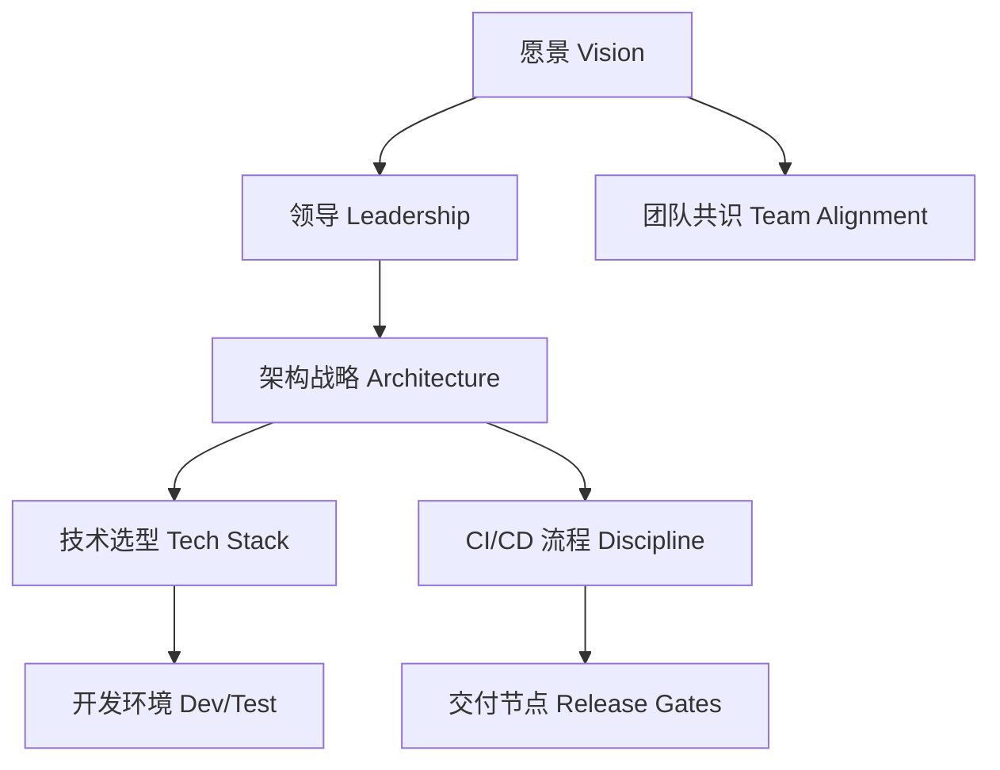

## 第一篇：计篇

**Laying Plans: Project Kickoff & System Design**
**战略规划：项目启动与架构布局**

---

### 🏮 原文 + 英译

> **孙子曰：兵者，国之大事，死生之地，存亡之道，不可不察也。**
> Sun Tzu said: The art of war is of vital importance to the State. It is a matter of life and death, a road either to safety or to ruin. Hence, it is a subject of inquiry which can on no account be neglected.

> **故经之以五事，校之以计，而索其情：一曰道，二曰天，三曰地，四曰将，五曰法。**
> Therefore, in laying plans, compare the following seven elements: the Moral Law, Heaven, Earth, the Commander, and Method and Discipline.

---

### 💡 程序员注解 Programmer’s Interpretation

“兵者，国之大事”，正如架构之于系统，是系统成败的起点。一个成功的软件项目，必须在启动阶段就完成全面的**战略规划**，包括产品愿景、技术路径、团队结构与交付节奏。

五事比喻为软件工程：

| 兵法元素    | 软件比喻               |
| ------- | ------------------ |
| 道（愿景一致） | 产品目标与团队对齐          |
| 天（时机）   | 项目窗口期，市场节奏         |
| 地（环境）   | 技术选型、部署场景          |
| 将（领导）   | 技术负责人、架构师          |
| 法（纪律）   | 编码规范、敏捷流程、CI/CD 策略 |

---

### 🧪 应用场景 Application Scenarios

* 启动新项目时的架构设计会议
* 微服务系统的初始边界划分
* 产品 MVP 的功能裁剪与优先级规划
* 团队协作规范设定（代码格式、分支模型）

---

### ⚔️ 技术格言 Tech Aphorism

> 架构不明，项目必乱；
> 战略不清，团队必散。

> No clear architecture, no successful project.
> No shared vision, no united team.

---

### 💻 C# 代码类比（愿景、角色与规则）

```csharp
// 定义项目基础抽象：道、天、地、将、法

public record Vision(string Mission, string TeamAgreement);
public record Timing(DateTime StartDate, TimeSpan MarketWindow);
public record Environment(string CloudProvider, string[] TechStack);
public record Leadership(string Architect, string TechLead);
public record Discipline(string[] CodingRules, string CIProcess);

public class WarPlan
{
    public Vision Vision { get; init; }
    public Timing Timing { get; init; }
    public Environment Environment { get; init; }
    public Leadership Leadership { get; init; }
    public Discipline Discipline { get; init; }
}
```

---

### 🗺️ 系统架构图类比（Mermaid）



---

### 📌 编写建议摘要

* 项目开始前，应以五事为基础拟定“战略规划文档”
* 架构师角色要清晰分工，推动道、将、法统一
* 架构图和代码规范应伴随启动会议落地

---

是否继续生成**第二篇《作战篇》：资源调度与交付控制**？或者你希望我先将这篇内容导出为排版精美的 PDF 页（含插画和封面风格）？
