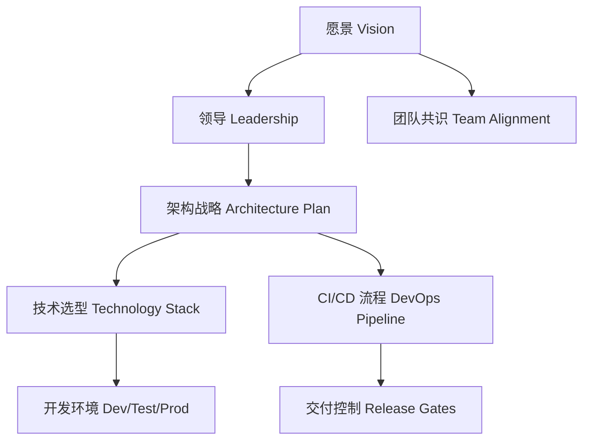

[Back to 目录（Index）](https://github.com/uwspstar/The-Programmer-s-Art-of-War/blob/main/Index.md)

## 第一篇：计篇

**Chapter 1: Laying Plans**
**战略规划：项目启动与架构布局**

---

### 🏮 原文 + 英译 Original & Translation

> **孙子曰：兵者，国之大事，死生之地，存亡之道，不可不察也。**
> Sun Tzu said: The art of war is of vital importance to the State. It is a matter of life and death, a road either to safety or to ruin. Hence, it must be thoroughly examined.

> **故经之以五事，校之以计，而索其情：一曰道，二曰天，三曰地，四曰将，五曰法。**
> Therefore, it must be assessed in terms of five factors and compared to derive the true situation: the Moral Law, Heaven, Earth, the Commander, and Method & Discipline.

---

### 💡 程序员解读 Programmer's Interpretation

> “兵者，国之大事”，正如架构之于系统，是系统成败的起点。
> "War is of vital importance" — just like architecture is to a software system. It determines success or failure.

> 一个成功的软件项目，必须在启动阶段完成全面的战略规划。
> A successful software project requires thorough strategic planning from the very beginning.

> 孙子提出的五事原则，正可映射为软件工程五基石。
> Sun Tzu's five factors map directly to the five cornerstones of software engineering.

| 兵法五事        | 软件工程类比                                  |
| ----------- | --------------------------------------- |
| **道（愿景一致）** | Product vision & team alignment         |
| **天（时机）**   | Market timing & development windows     |
| **地（环境）**   | Deployment & runtime environment        |
| **将（主导者）**  | Technical leaders & architects          |
| **法（规则制度）** | Code standards, agile discipline, CI/CD |

---

### 🧪 应用场景 Application Scenarios

> * 启动新项目时的架构设计会议
> * Architecture kickoff meetings for new projects
> * 产品 MVP 的功能裁剪与优先级设定
> * MVP feature prioritization and scoping
> * 微服务系统的边界划分
> * Microservice boundary definitions
> * 团队协作与代码规范的统一制定
> * Team conventions and code standard alignment

---

### ⚔️ 技术格言 Technical Aphorism

> 架构不明，项目必乱；战略不清，团队必散。
> Without clear architecture, projects descend into chaos; without shared vision, teams fall apart.

> 设计先于编码，规划胜于热血。
> Design precedes coding; planning beats passion.

---

### 💻 C# 代码类比 Code Analogy

```csharp
// 五事之道：在软件项目中映射为战略基石
public record Vision(string Mission, string TeamAlignment); // 道
public record Timing(DateTime Kickoff, TimeSpan DeliveryWindow); // 天
public record Environment(string Cloud, string[] Stack); // 地
public record Leadership(string Architect, string Lead); // 将
public record Discipline(string[] Standards, string CICD); // 法

public class WarPlan // 战略规划
{
    public Vision Vision { get; init; }
    public Timing Timing { get; init; }
    public Environment Environment { get; init; }
    public Leadership Leadership { get; init; }
    public Discipline Discipline { get; init; }
}
```

> 代码中的 `WarPlan` 即是一个完整的项目战略框架模型。
> The `WarPlan` class models the complete strategic blueprint of a project.

---

### 🗺️ 架构图示 Architectural Diagram (Mermaid)



> 此图展示从“道”到“法”的整体系统规划路径。
> This diagram shows the holistic flow from vision to discipline.

---

### 📌 总结 Summary

> * 项目前期应制定五项核心要素，形成“WarPlan”文档
> * In the early stage, define the five essentials to form a "WarPlan" document
> * 架构师要引导愿景落地、标准一致、交付节奏清晰
> * Architects should align vision, set standards, and guide delivery cadence
> * 所有代码规范、部署路径都应在启动阶段达成共识
> * Code standards and deployment paths must be agreed upon during kickoff
