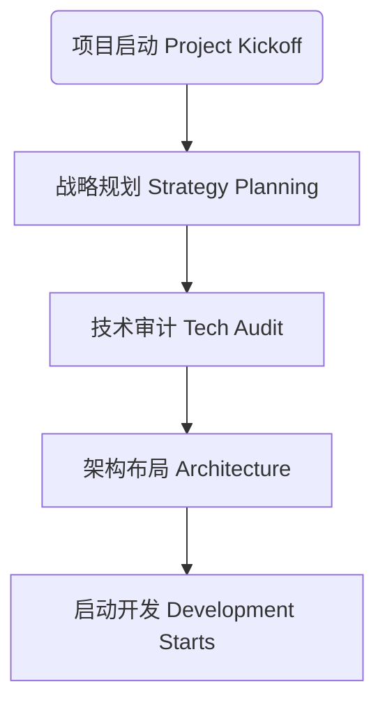
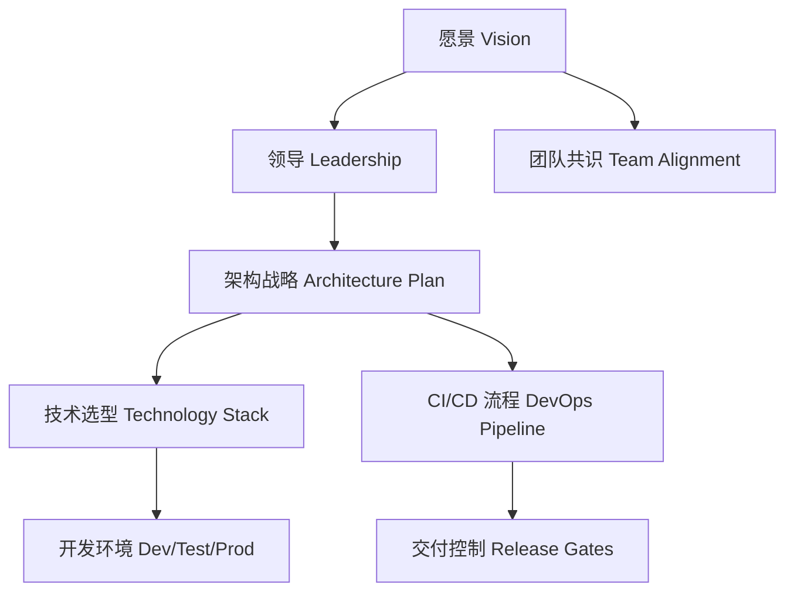

[Back to 目录（Index）](https://github.com/uwspstar/The-Programmer-s-Art-of-War/blob/main/Index.md)

## 第一篇：计篇

**Chapter 1: Laying Plans**
**战略规划：项目启动与架构布局**

### 原文 + 英译 Original & Translation 

> **孙子曰：兵者，国之大事，死生之地，存亡之道，不可不察也。**
> Sun Tzu said: The art of war is of vital importance to the State. It is a matter of life and death, a road either to safety or to ruin. Hence, it must be thoroughly examined.

> **故经之以五事，校之以计，而索其情：一曰道，二曰天，三曰地，四曰将，五曰法。**
> Therefore, it must be assessed in terms of five factors and compared to derive the true situation: the Moral Law, Heaven, Earth, the Commander, and Method & Discipline.

### 程序员解读 Programmer's Interpretation

> “兵者，国之大事”，正如架构之于系统，是系统成败的起点。
> "War is of vital importance" — just like architecture is to a software system. It determines success or failure.

> 一个成功的软件项目，必须在启动阶段完成全面的战略规划。
> A successful software project requires thorough strategic planning from the very beginning.

> 孙子提出的五事原则，正可映射为软件工程五基石。
> Sun Tzu's five factors map directly to the five cornerstones of software engineering.

| 兵法五事        | 软件工程类比                                  |
| ----------- | --------------------------------------- |
| **道（愿景一致）** | Product vision & team alignment         |
| **天（时机）**   | Market timing & development windows     |
| **地（环境）**   | Deployment & runtime environment        |
| **将（主导者）**  | Technical leaders & architects          |
| **法（规则制度）** | Code standards, agile discipline, CI/CD |

### 5W 战略提问法 5Ws Strategic Thinking Prompts

5W 战略提问法，源于兵法“庙算多者胜”的思想，帮助项目负责人在动手编码前，从多个维度透视项目全局。
The 5Ws framework is derived from Sun Tzu's idea that "those who make many calculations in the temple before the war will win." It helps tech leads grasp the full scope of a project before a single line of code is written.

每一个“W”对应一个兵法中的关键考量：战略目标、敌我态势、战场环境、时间窗口、资源部署。
Each "W" maps to a key principle in warfare: strategic goal, enemy understanding, battlefield condition, timing, and resource placement.

**Why? 为什么？**

* **Interpretation 解读：** Why are we building this? What problem does it solve?
  为什么要做这个项目？它解决什么问题？
* **Solution 解法建议：** Start from user perspective, document clear pain points and business motivations.
  从用户视角出发，建立清晰的痛点文档与商业动机分析。

**What? 做什么？**

* **Interpretation 解读：** What exactly are we building? What are the core features?
  我们要构建的产品是什么？目标功能有哪些？
* **Solution 解法建议：** Define MVP feature list and align with product owners.
  制定 MVP 功能清单，并与产品负责人共识对齐。

**Who? 为谁做？**

* **Interpretation 解读：** Who are the end users? Who are the stakeholders?
  谁是最终用户？谁是利益相关方？
* **Solution 解法建议：** Create user personas and stakeholder maps.
  绘制用户画像（persona）与利益相关图谱（stakeholder map）。

**When? 何时交付？**

* **Interpretation 解读：** What is the timeline and release cadence?
  时间表和交付节奏如何规划？
* **Solution 解法建议：** Break down milestones and set a Sprint/Release calendar.
  拆解里程碑与版本节奏，规划 Sprint 或 Release 日历。

**Where? 哪里运行？**

* **Interpretation 解读：** Where will the system run? How does it affect the architecture?
  系统部署在哪？如何影响架构设计？
* **Solution 解法建议：** Clarify cloud platform, edge location, and deployment zones to guide security and performance strategies.
  明确云服务平台、边缘设备、部署区域，影响安全与性能策略。 Where? | 系统部署在哪？如何影响架构设计？
  Where will the system run? How does it affect the architecture? | 明确云服务平台、边缘设备、部署区域，影响安全与性能策略。
  Clarify cloud platform, edge location, and deployment zones to guide security and performance strategies. |


> Reminder: If you go to war without a solid plan, your project becomes fire-fighting — chaos is inevitable. 提醒：若无良策而急于动兵，开发即变“火攻”，项目势必陷入混乱。

### 应用场景 Scenarios

* Starting a brand-new startup project (from 0 to 1) 启动一个全新的创业项目时（0 → 1 阶段）

* Refactoring a large monolithic system into microservices 重构大型单体系统为微服务

* Evaluating whether to adopt a new technology or framework 评估是否引入某项新技术或框架

* Creating a quarterly OKR roadmap for product and technology 为季度 OKR 制定产品与技术路线图

* Discussing with business teams why technology matters 与业务部门讨论“技术为什么重要”

### 技术格言 Technical Aphorism

> “一名优秀的架构师，必是战略家。” “Every great architect is a strategist.”

> “无计划，则计划失败。” “Failing to plan is planning to fail.”

### C# 类比代码 C# Code Analogy

```csharp
public class StrategyPlan
{
    public string BusinessGoal { get; set; }
    public List<string> Risks { get; set; }
    public string ArchitectureModel { get; set; }
    public List<string> KeyPlayers { get; set; }
    public bool IsReadyToStart => !string.IsNullOrEmpty(BusinessGoal) && !string.IsNullOrEmpty(ArchitectureModel);
}
```

### 架构图类比 Diagram Analogy



### 应用场景 Application Scenarios

> * 启动新项目时的架构设计会议 Architecture kickoff meetings for new projects
> * 产品 MVP 的功能裁剪与优先级设定 MVP feature prioritization and scoping
> * 微服务系统的边界划分 Microservice boundary definitions
> * 团队协作与代码规范的统一制定 Team conventions and code standard alignment

### 技术格言 Technical Aphorism

> 架构不明，项目必乱；战略不清，团队必散。 Without clear architecture, projects descend into chaos; without shared vision, teams fall apart.

> 设计先于编码，规划胜于热血。 Design precedes coding; planning beats passion.

### C# 代码

```csharp
// 五事之道：在软件项目中映射为战略基石
public record Vision(string Mission, string TeamAlignment); // 道
public record Timing(DateTime Kickoff, TimeSpan DeliveryWindow); // 天
public record Environment(string Cloud, string[] Stack); // 地
public record Leadership(string Architect, string Lead); // 将
public record Discipline(string[] Standards, string CICD); // 法

public class WarPlan // 战略规划
{
    public Vision Vision { get; init; }
    public Timing Timing { get; init; }
    public Environment Environment { get; init; }
    public Leadership Leadership { get; init; }
    public Discipline Discipline { get; init; }
}
```

> 代码中的 `WarPlan` 即是一个完整的项目战略框架模型。
> The `WarPlan` class models the complete strategic blueprint of a project.

### 架构图示 Architectural Diagram



> 此图展示从“道”到“法”的整体系统规划路径。
> This diagram shows the holistic flow from vision to discipline.

### 总结 Summary

> * 项目前期应制定五项核心要素，形成“WarPlan”文档
> * In the early stage, define the five essentials to form a "WarPlan" document
> * 架构师要引导愿景落地、标准一致、交付节奏清晰
> * Architects should align vision, set standards, and guide delivery cadence
> * 所有代码规范、部署路径都应在启动阶段达成共识
> * Code standards and deployment paths must be agreed upon during kickoff
