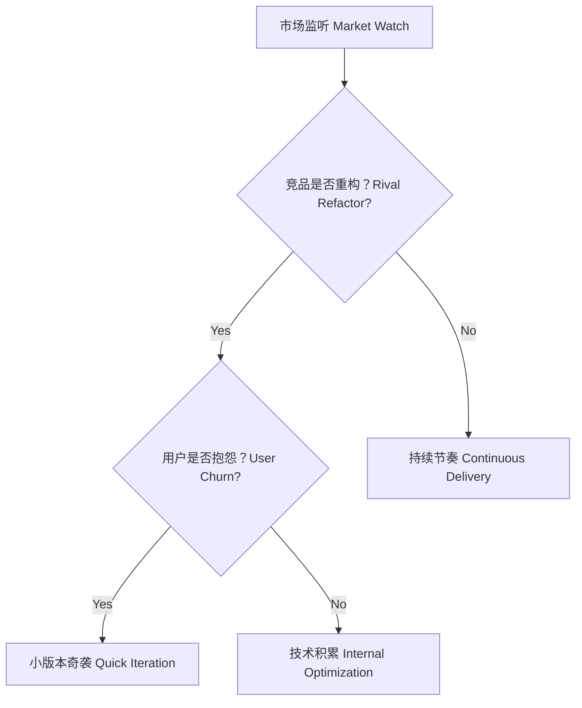

## 第七篇：军争篇

**Chapter 7: Armed Contest**
**竞品较量：市场冲突与技术演进节奏**

---

### 🏮 原文 + 英译 Original & Translation

> **凡军之道，主受敌而不怒，劳而不困，饥而不饱，寒而不衣，短而不退。**
> The art of war is to face the enemy without resentment, to endure fatigue without becoming exhausted, to face hunger without complaint, and to stand firm even when disadvantaged.

> **此军争之难也。**
> This is the difficulty of armed contest.

> **故善用兵者，避其锐气，击其惰归，此治气者也。**
> Therefore, the skillful warrior avoids the enemy’s momentum and strikes when their spirit is exhausted — this is mastery of timing.

---

### 💡 程序员解读 Programmer's Interpretation

> 技术世界的“军争”，即竞品之间的正面对抗与节奏掌控。
> In tech, "armed contest" refers to direct competition and timing control between rival products.

> 面对竞品更新、用户争夺、市场节奏，你要掌握三件事：
> Facing updates from rivals and market pressure, you must master three things:

1. **不硬刚（避其锋）**：不要盲目正面较劲
2. **选时机（乘其疲）**：等对方犯错或用户失望
3. **快响应（奇袭）**：用精巧特性击中用户需求

> 一场好的产品战，不是版本号更新的较量，而是节奏与用户心理的较量。
> A good product war isn’t about version numbers — it’s about rhythm and user psychology.

---

### 🧪 应用场景 Application Scenarios

> * 与竞品功能错位竞争（避实击虚）
> * Competing through differentiation rather than direct imitation

> * 快速响应用户痛点（小版本奇袭）
> * Micro-feature releases that address specific pain points

> * 掌握“节奏差”，在对方重构或危机时迭代出击
> * Exploiting timing gaps when competitors are refactoring or in crisis

> * 产品团队配合研发节奏形成“快打快退”循环
> * Coordinated product-engineering loops for rapid iterations

---

### ⚔️ 技术格言 Technical Aphorism

> 产品不是更新快，而是更新对。
> It's not about how fast you release — it's about what you release.

> 不要跟竞品同步节奏，而要打乱它。
> Don’t match your competitor’s rhythm — break it.

> 军争之道，在于先知先动，后发先至。
> The essence of tech warfare is to anticipate, act second, and arrive first.

---

### 💻 C# 代码类比 Code Analogy

```csharp
public class ProductWar
{
    private bool _rivalRewriting = true;
    private bool _userComplaining = true;

    public string DecideAction()
    {
        if (_rivalRewriting && _userComplaining)
            return "🔥 奇袭小版本 Quick Release!";
        else if (_rivalRewriting)
            return "⏳ 观察并预备下一轮 Wait & Observe";
        else
            return "💡 维持节奏 Iterate normally";
    }
}
```

> 此逻辑模拟了竞品疲态与用户反馈交集下的“迭代奇袭”判断策略。
> This logic simulates a strategic release decision when the rival is weak and users are restless.

---

### 🗺️ 架构图示 Architectural Diagram (Mermaid)



> 在竞争战中，信息监听 + 节奏判断 = 奇袭时机。
> In tech warfare, intelligence + timing = the perfect strike opportunity.

---

### 📌 总结 Summary

> * 与竞品竞争不是正面刚，而是“节奏战”
> * Competing with rivals is a matter of rhythm, not brute force

> * 善用“时机差”与“用户反弹点”可实现奇袭迭代
> * Strategic timing and user dissatisfaction trigger ideal micro-releases

> * 快慢结合、攻防有度，是产品军争之道
> * Alternating pace and offensive-defensive balance is the art of tech warfare
