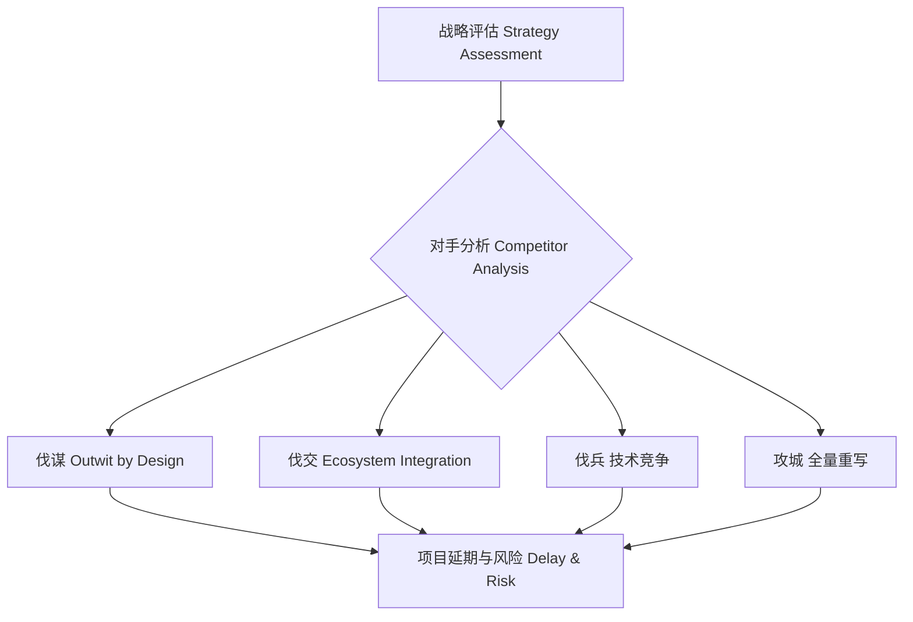

[Back to 目录（Index）](https://github.com/uwspstar/The-Programmer-s-Art-of-War/blob/main/Index.md)

## 第三篇：谋攻篇

**Chapter 3: Attack by Stratagem**
**架构攻防：技术选型与平台竞争**

### 原文 + 英译 Original & Translation

> **上兵伐谋，其次伐交，其次伐兵，其下攻城。** The best strategy is to outwit the enemy. The next best is to disrupt their alliances. Then comes engaging their forces. The worst strategy is to attack fortified cities.

> **知彼知己，百战不殆；不知彼而知己，一胜一负；不知彼不知己，每战必殆。** Know your enemy and know yourself, and you will not be imperiled in a hundred battles. If you only know yourself, you may win or lose. If you know neither, you will always be in danger.

### 程序员解读 Programmer's Interpretation

> 在技术竞争中，最有效的策略不是“打架”，而是“智胜”。In tech competition, the smartest strategy is not to fight harder — but to outsmart.

> **“上兵伐谋”**，指通过架构设计、用户体验、生态整合，压制对手。"Attack by strategy" means winning through superior architecture, user experience, and integration.

> **“攻城为下”**，如同盲目重构、平台之争、重复造轮子——耗时费力。"Siege warfare" is like over-engineering, tech ego wars, or reinventing the wheel — costly and inefficient.

> 技术领导者要学会：“技术选型是战略，而不是兴趣。” A tech lead must realize: choosing technology is a strategic act, not a hobby.

### 5W 战略提问法 5Ws Strategic Thinking Prompts — Chapter 3: 

Attack by Stratagem 谋攻篇强调“上兵伐谋”，即在开发和竞争中优先使用智谋、策略、整合与合作，而非一味强攻或重构。

**Why outsmart rather than outfight? 为什么要“谋”而不是“攻”？**

* **Interpretation 解读：** Can we solve the problem through strategy, negotiation, or reuse instead of brute-force development?
  我们能否通过策略、谈判或重用，而非硬编码去解决问题？
* **Solution 解法建议：** First consider design patterns, existing libraries, open APIs, or strategic alliances.
  优先考虑设计模式、已有库、开放 API 或战略合作。

**What is our highest-leverage advantage? 我们最有杠杆的优势是什么？**

* **Interpretation 解读：** Which assets, codebases, or team strengths give us leverage?
  哪些资产、代码基础或团队能力能带来乘法效应？
* **Solution 解法建议：** Identify your “multipliers” early and build architecture around them.
  早期识别“杠杆因子”，围绕它构建架构。

**Who can be turned into allies? 谁可以变成盟友？**

* **Interpretation 解读：** Which competing team, vendor, or user group can be co-opted instead of challenged?
  哪些对手、供应商或用户群可以被联合，而不是正面冲突？
* **Solution 解法建议：** Use partnership APIs, shared platform standards, or join open-source ecosystems.
  借助平台 API、标准协议或开源生态建立协同关系。

**When to avoid direct confrontation? 何时该避免正面交锋？**

* **Interpretation 解读：** Is this the best time to launch a feature or fight for tech adoption?
  当前是否是上线某功能或推行技术的最佳时机？
* **Solution 解法建议：** Delay confrontation until you gain market insight, timing, or internal support.
  等待更好的用户洞察、时机或内部背书再出手。

**Where can we win without fighting? 哪里能不战而胜？**

* **Interpretation 解读：** Which user segment, use case, or niche can we capture through precision instead of scale?
  哪些用户细分、场景或利基市场能通过精准方案胜出？
* **Solution 解法建议：** Apply laser-focus to underserved pain points with elegant small-scale solutions.
  用小而美的解决方案专攻痛点，切入核心。

> * 提醒：优秀的架构师知道如何打胜仗，更知道如何避免不必要的战争。Reminder: A great architect knows how to win, but more importantly, when not to fight.

### 应用场景 Application Scenarios

> * 架构升级的技术路线选择
> * Choosing the upgrade path during architectural transitions

> * 与竞品的性能/功能差异对比
> * Competitive benchmarking and strategic product differentiation

> * 第三方平台/API 选型与整合
> * Strategic API / platform integration decisions

> * 重构前的“战场形势评估”
> * Assessing battlefield (codebase) before large-scale refactoring

### 技术格言 Technical Aphorism

> 与其自造平台，不如整合生态。 Don’t build everything — win through ecosystem integration.

> 懂代码是初级，懂战略才是高级。Knowing code makes you a developer; knowing strategy makes you a leader.

> 攻心为上，攻城为下；用户体验优于技术炫技。 Win users’ hearts, not just their screens.

### C# 代码类比 Code Analogy

```csharp
public class TechStrategy
{
    public bool OutwitByDesign(bool competitorWeaknessExposed)
    {
        return competitorWeaknessExposed;
    }

    public bool DisruptAlliances(bool openAPIsUsed)
    {
        return openAPIsUsed;
    }

    public bool FightDirectly(bool rewriteCoreSystem)
    {
        return rewriteCoreSystem;
    }

    public bool SiegeMode(bool rebuildPlatformFromScratch)
    {
        return rebuildPlatformFromScratch; // 最下策
    }

    public string ChooseStrategy(bool weakSpots, bool openApis)
    {
        if (OutwitByDesign(weakSpots)) return "伐谋 - Outwit through design";
        if (DisruptAlliances(openApis)) return "伐交 - API 整合突围";
        if (FightDirectly(true)) return "伐兵 - 硬刚竞品";
        return "攻城 - 重写整个系统（下策）";
    }
}
```

> 在决策中，越早选择“伐谋”，成本越低，胜率越高。The earlier you choose strategic thinking, the lower the cost and the higher the odds of success.

### 架构图示 Architectural Diagram



> 图中显示战略路径从“智取”到“强攻”的风险与收益对比。 The diagram visualizes the risk-reward spectrum from strategic to brute-force approaches.

### 总结 Summary

> * 架构与技术选型应基于形势与用户体验，而非盲目热情 * Architecture and tech choices should be shaped by context, not passion

> * 了解竞争者是架构决策的必修课 * Studying competitors is critical in making the right architectural calls

> * 每一次重构，都应先问一句：我是在“攻城”吗？* Before any major rewrite, ask: am I laying siege?
