[Back to 目录（Index）](https://github.com/uwspstar/The-Programmer-s-Art-of-War/blob/main/Index.md)

## 第三篇：谋攻篇

**Chapter 3: Attack by Stratagem**
**架构攻防：技术选型与平台竞争**

---

### 🏮 原文 + 英译 Original & Translation

> **上兵伐谋，其次伐交，其次伐兵，其下攻城。**
> The best strategy is to outwit the enemy. The next best is to disrupt their alliances. Then comes engaging their forces. The worst strategy is to attack fortified cities.

> **知彼知己，百战不殆；不知彼而知己，一胜一负；不知彼不知己，每战必殆。**
> Know your enemy and know yourself, and you will not be imperiled in a hundred battles. If you only know yourself, you may win or lose. If you know neither, you will always be in danger.

---

### 💡 程序员解读 Programmer's Interpretation

> 在技术竞争中，最有效的策略不是“打架”，而是“智胜”。
> In tech competition, the smartest strategy is not to fight harder — but to outsmart.

> **“上兵伐谋”**，指通过架构设计、用户体验、生态整合，压制对手。
> "Attack by strategy" means winning through superior architecture, user experience, and integration.

> **“攻城为下”**，如同盲目重构、平台之争、重复造轮子——耗时费力。
> "Siege warfare" is like over-engineering, tech ego wars, or reinventing the wheel — costly and inefficient.

> 技术领导者要学会：“技术选型是战略，而不是兴趣。”
> A tech lead must realize: choosing technology is a strategic act, not a hobby.

---

### 🧪 应用场景 Application Scenarios

> * 架构升级的技术路线选择
> * Choosing the upgrade path during architectural transitions

> * 与竞品的性能/功能差异对比
> * Competitive benchmarking and strategic product differentiation

> * 第三方平台/API 选型与整合
> * Strategic API / platform integration decisions

> * 重构前的“战场形势评估”
> * Assessing battlefield (codebase) before large-scale refactoring

---

### ⚔️ 技术格言 Technical Aphorism

> 与其自造平台，不如整合生态。
> Don’t build everything — win through ecosystem integration.

> 懂代码是初级，懂战略才是高级。
> Knowing code makes you a developer; knowing strategy makes you a leader.

> 攻心为上，攻城为下；用户体验优于技术炫技。
> Win users’ hearts, not just their screens.

---

### 💻 C# 代码类比 Code Analogy

```csharp
public class TechStrategy
{
    public bool OutwitByDesign(bool competitorWeaknessExposed)
    {
        return competitorWeaknessExposed;
    }

    public bool DisruptAlliances(bool openAPIsUsed)
    {
        return openAPIsUsed;
    }

    public bool FightDirectly(bool rewriteCoreSystem)
    {
        return rewriteCoreSystem;
    }

    public bool SiegeMode(bool rebuildPlatformFromScratch)
    {
        return rebuildPlatformFromScratch; // 最下策
    }

    public string ChooseStrategy(bool weakSpots, bool openApis)
    {
        if (OutwitByDesign(weakSpots)) return "伐谋 - Outwit through design";
        if (DisruptAlliances(openApis)) return "伐交 - API 整合突围";
        if (FightDirectly(true)) return "伐兵 - 硬刚竞品";
        return "攻城 - 重写整个系统（下策）";
    }
}
```

> 在决策中，越早选择“伐谋”，成本越低，胜率越高。
> The earlier you choose strategic thinking, the lower the cost and the higher the odds of success.

---

### 🗺️ 架构图示 Architectural Diagram (Mermaid)

```mermaid
graph TD
    A[战略评估 Strategy Assessment] --> B{对手分析 Competitor Analysis}
    B --> C1[伐谋 Outwit by Design]
    B --> C2[伐交 Ecosystem Integration]
    B --> C3[伐兵 技术竞争]
    B --> C4[攻城 全量重写]

    C1 --> D[用户体验提升 UX Upgrade]
    C2 --> D[平台协同 Platform Leverage]
    C3 --> D[性能优化 Code Refactoring]
    C4 --> D[项目延期与风险 Delay & Risk]
```



> 图中显示战略路径从“智取”到“强攻”的风险与收益对比。
> The diagram visualizes the risk-reward spectrum from strategic to brute-force approaches.

---

### 📌 总结 Summary

> * 架构与技术选型应基于形势与用户体验，而非盲目热情
> * Architecture and tech choices should be shaped by context, not passion

> * 了解竞争者是架构决策的必修课
> * Studying competitors is critical in making the right architectural calls

> * 每一次重构，都应先问一句：我是在“攻城”吗？
> * Before any major rewrite, ask: am I laying siege?
