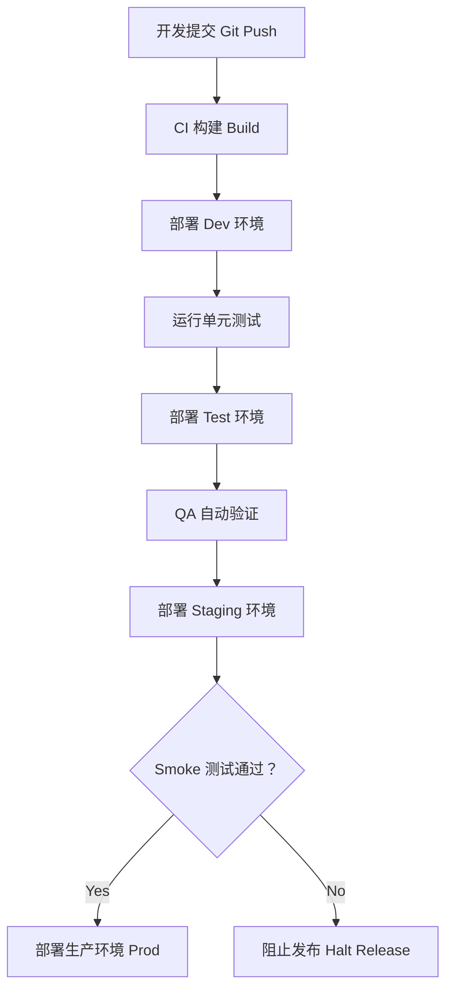

## 第九篇：行军篇

**Chapter 9: The March**
**部署策略：CI/CD 与多环境切换之道**

---

### 🏮 原文 + 英译 Original & Translation

> **凡军之道，疾如风，徐如林，侵掠如火，不动如山。**
> In warfare, your movement should be swift like the wind, orderly like the forest, fierce like fire, and steady like the mountain.

> **知彼之来者，则趋而迎之，以利动也。**
> When you know the enemy is approaching, anticipate and intercept them — this is acting with advantage.

> **不知地形，不可以行军；不知山林险阻、沮泽之形者，不可以用兵。**
> Without understanding the terrain, one should not march; without knowing forests, rivers, and obstacles, one should not engage in battle.

---

### 💡 程序员解读 Programmer's Interpretation

> 软件部署就是“行军”，环境就是“地形”，
> Software deployment is marching; environments are terrains.

> 想要稳定上线，必须如行军般掌握四件事：
> To deploy safely, you must master four things:

1. **快如风**：构建 / 部署流程应高效自动化
2. **稳如山**：生产环境不可频繁波动
3. **隐如林**：版本号、接口变动要有策略
4. **烈如火**：遇异常要迅速应对、自动回滚

> 若环境未知（如测试环境不同步），部署必乱。
> If the terrain (environment) is unknown, deployment will fail.

> 运维体系的本质，是“知地形、掌时机、策移动”。
> The essence of operations is: understand terrain, control timing, plan movement.

---

### 🧪 应用场景 Application Scenarios

> * 多环境部署管理（Dev / Test / Staging / Prod）
> * Managing multi-stage environments: Dev → Test → Staging → Prod

> * 引入自动化部署工具（GitHub Actions, Azure DevOps, Jenkins）
> * CI/CD automation with GitHub Actions, Azure DevOps, or Jenkins

> * 环境隔离与配置注入（如 `appsettings.{env}.json`）
> * Environment isolation via configuration injection

> * 上线前的预检测、Smoke Test、变更审核流程
> * Smoke testing and change approval before release

---

### ⚔️ 技术格言 Technical Aphorism

> 每次部署，都是一次战役；每个环境，都是一个战场。
> Every deployment is a battle; every environment is a battlefield.

> 慢上线不是稳上线；自动化才是稳的前提。
> Slow release ≠ safe release. Automation ensures safety.

> 未知环境中上线，等于夜行军。
> Releasing into an unknown environment is marching in the dark.

---

### 💻 C# 代码类比 Code Analogy

```csharp
public class Deployment
{
    public enum Env { Dev, Test, Staging, Prod }

    public void DeployTo(Env environment)
    {
        Console.WriteLine($"🚀 Deploying to {environment}");

        switch (environment)
        {
            case Env.Prod:
                SmokeTest();
                break;
            case Env.Staging:
                NotifyStakeholders();
                break;
            default:
                break;
        }

        Console.WriteLine("✅ Deployment completed.");
    }

    private void SmokeTest() =>
        Console.WriteLine("🔥 Running smoke tests...");

    private void NotifyStakeholders() =>
        Console.WriteLine("📢 Notifying QA & Product...");
}
```

> 此代码模拟多环境部署策略：不同阶段部署应有不同策略与验证机制。
> This code models deployment variations: each environment requires tailored precautions.

---

### 🗺️ 架构图示 Architectural Diagram (Mermaid)



> 架构图清晰呈现了“逐步推进 + 自动判断 + 阶段检测”的行军式部署策略。
> This diagram shows staged deployment: step-by-step movement with automated checks — like a military march.

---

### 📌 总结 Summary

> * 多环境部署是现代系统的基本作战策略
> * Multi-environment deployment is modern software warfare

> * 部署流程应“快、稳、可回退”，不靠手工、不靠记忆
> * Deployments must be fast, stable, and reversible — not manual or memory-based

> * 成熟团队的 DevOps 是“行军式作战”而非“游击战”
> * Mature DevOps behaves like coordinated military maneuvers — not guerrilla warfare
