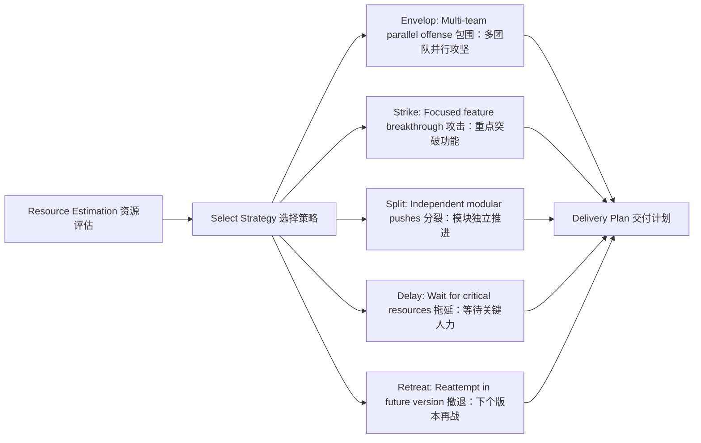

[Back to 目录（Index）](https://github.com/uwspstar/The-Programmer-s-Art-of-War/blob/main/Index.md)

## 第二篇：作战篇

**Chapter 2: Waging War**
**资源调度：开发周期与交付控制**

### 原文 + 英译 Original & Translation

> **凡用兵之法，全国为上，破国次之；全军为上，破军次之。** In the operations of war, the best policy is to take a state intact; to ruin it is inferior.

> **是故百战百胜，非善之善者也；不战而屈人之兵，善之善者也。** Thus, to win a hundred victories in a hundred battles is not the acme of skill. To subdue the enemy without fighting is the acme of skill.

> **故用兵之法，十则围之，五则攻之，倍则分之。** The method of employing the military: when ten times the enemy’s strength, surround them; when five times, attack; when double, divide.

### 程序员解读 Programmer's Interpretation

> 在项目中，“资源”即兵力，“交付”即作战。In a software project, resources are your troops, and delivery is the battlefield.

> 管理者最大的智慧，是在不“过度燃烧团队”的前提下达成高质量交付。A great manager delivers high quality without burning out the team.

> “百战百胜非善”，意味着频繁加班与救火并非真正的胜利，"Winning all battles is not ideal" — frequent overtime and firefighting are not real success.

> 真正的高手，是让系统“自动胜出”，即通过策略、自动化与预判让问题未发先解。True mastery lies in systems that win through strategy, automation, and foresight.

### 5W 战略提问法 5Ws Strategic Thinking Prompts – Chapter 2: Waging War

本章聚焦资源投入与回报的平衡，5W 帮助我们识别“值得开战”的边界与投入判断。
This chapter emphasizes the balance between investment and return. The 5Ws help assess whether the “war” is worth fighting and how much to commit.

**Why wage this war? 为什么要投入这场开发战？**

* **Interpretation 解读：** What value will this bring to the organization or users?
  这场项目战役将为组织或用户带来什么价值？
* **Solution 解法建议：** Quantify expected returns (user growth, revenue, efficiency) before committing resources.
  在投入口前评估并量化预期收益（用户增长、营收、效率等）。

**What resources will be consumed? 我们将消耗什么资源？**

* **Interpretation 解读：** Do we have enough team bandwidth, budget, and infrastructure?
  是否具备足够的团队人力、预算和基础设施？
* **Solution 解法建议：** Create a burn-rate model and simulate different delivery scenarios.
  建立资源燃烧模型，模拟不同交付方案的投入成本。

**Who bears the burden and risk? 谁承担成本与风险？**

* **Interpretation 解读：** Which teams will be impacted? Who makes the trade-offs?
  哪些团队将承担风险与压力？谁负责权衡？
* **Solution 解法建议：** Host a stakeholder war room and prepare fallback options.
  举行干系人作战会议，预备后备方案。

**When does cost overrun begin? 何时“战争”将拖垮我们？**

* **Interpretation 解读：** What's the cost ceiling? What are the kill-switch triggers?
  成本上限在哪？何时必须中止投入？
* **Solution 解法建议：** Define fail-fast checkpoints and risk thresholds.
  设立快速失败检查点和成本风险阈值。

**Where to concentrate effort? 我们应在哪集中兵力？**

* **Interpretation 解读：** Which feature/module/market is the most critical? 哪个功能/模块/市场是战略主攻点？
* **Solution 解法建议：** Apply the 80/20 rule to focus effort on high-leverage components. 运用 80/20 法则，将兵力集中于高杠杆组件上。


> * 提醒：没有边界的投入不是战略，而是消耗。Reminder: Unlimited input without boundary is not strategy — it's erosion.

### 应用场景 Application Scenarios

> * 产品交付节奏设计（敏捷 vs 瀑布）Designing delivery cadence (Agile vs Waterfall)

> * 团队人力资源分配（Dev / QA / DevOps）Allocating team resources (Dev / QA / DevOps)

> * 估时与排期策略（避免 deadline 地狱）Estimation and scheduling strategy (avoiding deadline hell)

> * 灾备资源调度（On-call & hotfix policy）Incident preparedness (on-call rotations, hotfix playbooks)

### 技术格言 Technical Aphorism

> * 一次紧急救火是英雄，多次救火是体制失败。One firefight is heroism; frequent ones reflect systemic failure.

> * 时间不管理你，你就会被时间管理。If you don’t manage time, time will manage you.


### C# 代码类比 Code Analogy

```csharp
// 模拟交付资源与策略
public enum Strategy
{
    Encircle, Attack, Split, Delay, Retreat
}

public record Resource(int Developers, int Testers, int DevOps);

public class DeliveryPlanner
{
    public static Strategy SelectStrategy(Resource ours, Resource enemy)
    {
        int ourTotal = ours.Developers + ours.Testers;
        int enemyTotal = enemy.Developers + enemy.Testers;

        if (ourTotal >= enemyTotal * 10) return Strategy.Encircle;
        if (ourTotal >= enemyTotal * 5) return Strategy.Attack;
        if (ourTotal >= enemyTotal * 2) return Strategy.Split;
        return Strategy.Delay; // 若不利则拖延，待后续优化
    }
}
```

> 程序中资源分配策略体现了“兵力评估”与“决策方式”的自动化。This code automates tactical decisions based on resource ratios — the heart of efficient delivery.

### 架构图示 Architectural Diagram



> 此图模拟以“敌我比”为输入，形成多样交付路径的策略输出。This diagram illustrates adaptive delivery planning based on team capacity and project pressure.

### 总结 Summary

> * 项目经理应以全局视角评估资源与风险 Project managers must assess team capability and delivery risk holistically

> * 不以加班为常态，不以混乱为英勇 Heroism is not the norm. Planning beats chaos.

> * 自动决策与资源评估机制，能提升团队稳定交付能力 Automated planning enhances the team’s ability to deliver consistently and calmly
