[Back to 目录（Index）](https://github.com/uwspstar/The-Programmer-s-Art-of-War/blob/main/Index.md)

## 第二篇：作战篇

**Chapter 2: Waging War**
**资源调度：开发周期与交付控制**

---

### 🏮 原文 + 英译 Original & Translation

> **凡用兵之法，全国为上，破国次之；全军为上，破军次之。**
> In the operations of war, the best policy is to take a state intact; to ruin it is inferior.

> **是故百战百胜，非善之善者也；不战而屈人之兵，善之善者也。**
> Thus, to win a hundred victories in a hundred battles is not the acme of skill. To subdue the enemy without fighting is the acme of skill.

> **故用兵之法，十则围之，五则攻之，倍则分之。**
> The method of employing the military: when ten times the enemy’s strength, surround them; when five times, attack; when double, divide.

---

### 💡 程序员解读 Programmer's Interpretation

> 在项目中，“资源”即兵力，“交付”即作战。
> In a software project, resources are your troops, and delivery is the battlefield.

> 管理者最大的智慧，是在不“过度燃烧团队”的前提下达成高质量交付。
> A great manager delivers high quality without burning out the team.

> “百战百胜非善”，意味着频繁加班与救火并非真正的胜利，
> "Winning all battles is not ideal" — frequent overtime and firefighting are not real success.

> 真正的高手，是让系统“自动胜出”，即通过策略、自动化与预判让问题未发先解。
> True mastery lies in systems that win through strategy, automation, and foresight.

---

### 🧪 应用场景 Application Scenarios

> * 产品交付节奏设计（敏捷 vs 瀑布）
> * Designing delivery cadence (Agile vs Waterfall)

> * 团队人力资源分配（Dev / QA / DevOps）
> * Allocating team resources (Dev / QA / DevOps)

> * 估时与排期策略（避免 deadline 地狱）
> * Estimation and scheduling strategy (avoiding deadline hell)

> * 灾备资源调度（On-call & hotfix policy）
> * Incident preparedness (on-call rotations, hotfix playbooks)

---

### ⚔️ 技术格言 Technical Aphorism

> 一次紧急救火是英雄，多次救火是体制失败。
> One firefight is heroism; frequent ones reflect systemic failure.

> 时间不管理你，你就会被时间管理。
> If you don’t manage time, time will manage you.

---

### 💻 C# 代码类比 Code Analogy

```csharp
// 模拟交付资源与策略
public enum Strategy
{
    Encircle, Attack, Split, Delay, Retreat
}

public record Resource(int Developers, int Testers, int DevOps);

public class DeliveryPlanner
{
    public static Strategy SelectStrategy(Resource ours, Resource enemy)
    {
        int ourTotal = ours.Developers + ours.Testers;
        int enemyTotal = enemy.Developers + enemy.Testers;

        if (ourTotal >= enemyTotal * 10) return Strategy.Encircle;
        if (ourTotal >= enemyTotal * 5) return Strategy.Attack;
        if (ourTotal >= enemyTotal * 2) return Strategy.Split;
        return Strategy.Delay; // 若不利则拖延，待后续优化
    }
}
```

> 程序中资源分配策略体现了“兵力评估”与“决策方式”的自动化。
> This code automates tactical decisions based on resource ratios — the heart of efficient delivery.

---

### 🗺️ 架构图示 Architectural Diagram (Mermaid)

```mermaid
flowchart LR
    A[资源评估 Resource Estimation] --> B[选择策略 Select Strategy]
    B --> C1[包围：多团队并行攻坚]
    B --> C2[攻击：重点突破功能]
    B --> C3[分裂：模块独立推进]
    B --> C4[拖延：等待关键人力]
    B --> C5[撤退：下个版本再战]

    C1 & C2 & C3 & C4 & C5 --> D[交付计划 Delivery Plan]
```



> 此图模拟以“敌我比”为输入，形成多样交付路径的策略输出。
> This diagram illustrates adaptive delivery planning based on team capacity and project pressure.

---

### 📌 总结 Summary

> * 项目经理应以全局视角评估资源与风险
> * Project managers must assess team capability and delivery risk holistically

> * 不以加班为常态，不以混乱为英勇
> * Heroism is not the norm. Planning beats chaos.

> * 自动决策与资源评估机制，能提升团队稳定交付能力
> * Automated planning enhances the team’s ability to deliver consistently and calmly
