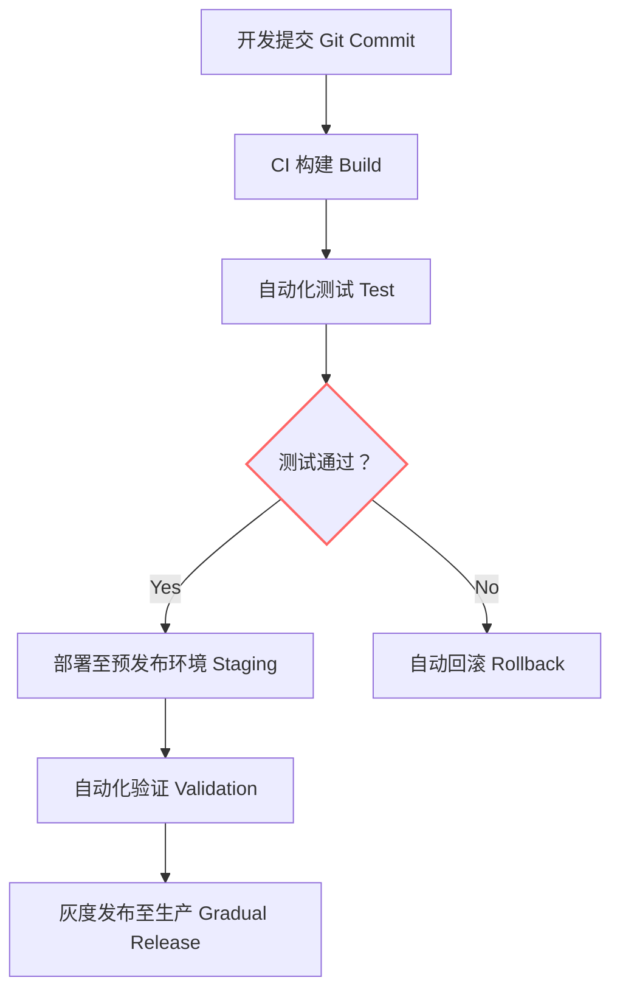

## 第五篇：兵势篇

**Chapter 5: Strategic Power**
**势能利用：技术杠杆与自动化优势**

---

### 🏮 原文 + 英译 Original & Translation

> **凡治众如治寡，分数是也；斗众如斗寡，形名是也。**
> Managing many is the same as managing few — it is a matter of organization. Fighting a large army is the same as fighting a small one — it is a matter of formation.

> **是故善用兵者，譬如率然。率然者，常山之蛇也，击其首则尾至，击其尾则首至，击其中则首尾俱至。**
> Thus the skillful commander is like the shuai ran snake of Mount Chang — strike its head, and its tail attacks; strike its tail, and its head attacks; strike the middle, and both head and tail attack.

---

### 💡 程序员解读 Programmer's Interpretation

> **“势”就是组织所能激发的系统力量。**
> "Strategic power" (势) refers to the systemic force unleashed by good structure and flow.

> 在程序世界中，“势”来源于：
> In the programming world, “势” comes from:

* 自动化流程（CI/CD、测试自动化）
* Automation pipelines (CI/CD, test automation)
* 标准化接口（RESTful APIs, SDKs）
* Standardized interfaces (REST APIs, SDKs)
* 基础设施即代码（IaC）
* Infrastructure as Code (IaC)
* 团队惯性（习惯用法、自动反应）
* Team reflexes (habitual responses & standards)

> 就如同“常山之蛇”，系统中的任一模块出问题，周边模块自动反应、修复或报警，这就是“势”。
> Like the serpent of Mount Chang, a resilient system auto-reacts to any failure — that is strategic power.

---

### 🧪 应用场景 Application Scenarios

> * 构建 CI/CD 自动化发布流水线
> * Building CI/CD pipelines for automatic deployment

> * 设置自动化回滚、健康检查、重启机制
> * Enabling rollback, health check, and auto-restart

> * 推动领域标准统一（接口规范、编码风格）
> * Driving standards: API contracts, coding conventions

> * 引入监控系统（如 Prometheus + Grafana）
> * Introducing monitoring (e.g., Prometheus + Grafana)

---

### ⚔️ 技术格言 Technical Aphorism

> 自动化不是工具，是势能。
> Automation is not a tool — it is strategic force.

> 最强的系统不是写了多少，而是删了多少还能正常运转。
> The strongest system is not one with more code, but one that survives even when code is removed.

---

### 💻 C# 代码类比 Code Analogy

```csharp
public class CICDPipeline
{
    public void Deploy()
    {
        Build();
        if (!RunTests()) Rollback();
        else Release();
    }

    private void Build() => Console.WriteLine("🔧 编译中 Building...");
    private bool RunTests()
    {
        Console.WriteLine("🧪 测试中 Running Tests...");
        return true; // 模拟通过
    }
    private void Release() => Console.WriteLine("🚀 发布成功 Released.");
    private void Rollback() => Console.WriteLine("⏪ 回滚中 Rolling back...");
}
```

> 自动化流程具备“攻击 + 防守 + 自愈”的能力，就是“势”。
> Automation that builds, tests, releases, and recovers embodies strategic power.

---

### 🗺️ 架构图示 Architectural Diagram (Mermaid)



> 此图展示了自动部署系统中“势”的链式反应过程。
> This diagram illustrates the cascading response that defines strategic power in automated systems.

---

### 📌 总结 Summary

> * “势”的来源是：标准、自动化、可预期的反应链
> * Strategic power arises from standards, automation, and predictable reaction chains

> * 管理 5 人团队和 500 人团队的秘诀，在于流程一致性
> * The secret to scaling from 5 to 500 engineers lies in repeatable processes

> * 想要高质量，就要先构建“自我修复”的自动系统
> * To achieve high quality, first build self-healing systems
