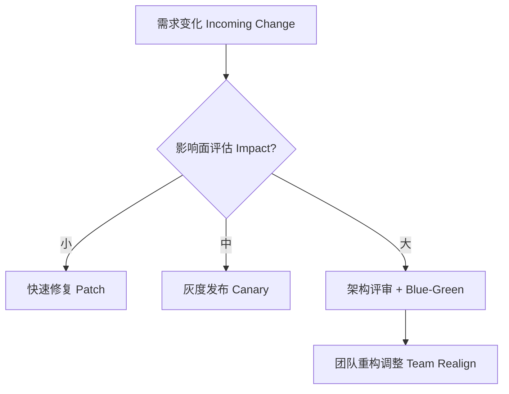

## 第八篇：九变篇

**Chapter 8: Variations and Adaptability**
**灵活应变：版本演进与策略切换**

---

### 🏮 原文 + 英译 Original & Translation

> **将能而君不御者胜。君御之而不知者不胜。**
> A commander who is empowered and not constrained by the sovereign will succeed; if constrained and uninformed, he will fail.

> **将有五危：必死可杀者，必生可虏者，忿速可侮者，廉洁可辱者，爱民可烦者。**
> There are five dangerous faults in a general: reckless bravery, fear of death, hasty temper, over-sensitivity to honor, and excessive compassion.

> **知此五者，知用兵之道也。**
> To know these five dangers is to understand how to manage armies.

---

### 💡 程序员解读 Programmer's Interpretation

> 程序员的世界，也有“版本之道”，变化即常态。
> In software, change is the only constant — managing versions is managing war.

> 真正的高手不是追求完美计划，而是**善变应变**。
> Mastery is not about rigid plans — it’s about strategic flexibility.

> 每一次变更，都可能来自这几种压力源：
> Every change originates from a pressure point:

| 压力源（五危）        | 软件工程类比            |
| -------------- | ----------------- |
| **必死（盲目乐观）**   | 不设回滚机制的上线         |
| **必生（害怕失败）**   | 不敢重构、不愿放弃旧代码      |
| **忿速（急躁冲动）**   | 为赶 deadline 草率上线  |
| **廉洁（过于理想主义）** | 不接受商业妥协，技术洁癖      |
| **爱民（过度迎合）**   | 每个用户提议都做，最终产品臃肿失控 |

> 应对之道，就是九变 —— 灵活切换，随势而动。
> The way to handle these is **variation** — fluid switching and dynamic decision-making.

---

### 🧪 应用场景 Application Scenarios

> * 重构策略灵活切换（渐进式 vs 一刀切）
> * Flexible refactoring strategies (progressive vs big bang)

> * 团队架构随阶段演进调整
> * Adjusting team structure based on product lifecycle

> * 产品路线根据市场反馈调整优先级
> * Reprioritizing roadmaps based on market signals

> * 应对突发事件时的策略切换（如停服、热修）
> * Switching strategies during crisis (downtime, hotfixes)

---

### ⚔️ 技术格言 Technical Aphorism

> 不变是最大的风险。
> The greatest risk is resisting change.

> 能改方向的团队，比方向正确更重要。
> A team that can change direction is more powerful than one that guesses right.

> 真正的稳定，是建立在灵活之上。
> True stability comes from flexibility.

---

### 💻 C# 代码类比 Code Analogy

```csharp
public class DeploymentStrategy
{
    public enum Mode { BigBang, Canary, BlueGreen, Manual }

    public string ChooseStrategy(bool isUrgent, bool isStable, bool userSensitive)
    {
        if (isUrgent && !isStable) return Mode.Canary.ToString();
        if (!isUrgent && isStable) return Mode.BlueGreen.ToString();
        if (userSensitive) return Mode.Manual.ToString();
        return Mode.BigBang.ToString(); // 下策
    }
}
```

> 应变策略必须考虑“紧急程度、系统稳定性、用户敏感度”。
> Variation strategies must balance urgency, stability, and user impact.

---

### 🗺️ 架构图示 Architectural Diagram (Mermaid)



> 此图展示了不同变更场景下的策略切换流程。
> This diagram illustrates how to adapt strategy based on the magnitude of change.

---

### 📌 总结 Summary

> * 灵活的架构与组织，能在“九变”中掌握主动权
> * Flexible architecture and teams dominate through adaptation

> * 将领的“五危”对应程序员的五种失败心态
> * The five faults of generals mirror developer anti-patterns

> * 产品周期、技术选择、团队配置都应允许“变”
> * Product, tech stack, and teams must all be variation-ready
