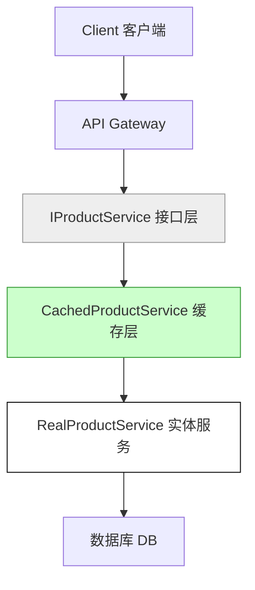

## 第六篇：虚实篇

**Chapter 6: Weakness and Strength**
**虚实之道：抽象、缓存与系统隐藏之术**

---

### 🏮 原文 + 英译 Original & Translation

> **兵无常势，水无常形，能因敌变化而取胜者，谓之神。**
> In war, there are no constant tactics, just as water has no constant shape. The ability to adapt and seize victory is supreme.

> **攻其无备，出其不意。**
> Attack where the enemy is unprepared; appear where you are least expected.

> **形人而我无形，则我专而敌分。**
> If I can make myself formless while causing the enemy to take form, I can concentrate while they are dispersed.

---

### 💡 程序员解读 Programmer's Interpretation

> 系统最强之处，在于“对外虚，对内实”。
> A great system is vague on the outside and solid on the inside.

> “虚”是隐藏复杂性，对外暴露简单抽象；“实”是内部结构坚实、模块高耦合度控制。
> "Weakness" is the illusion — abstract interfaces. "Strength" is the core logic, hidden but solid.

> 系统架构的核心，是通过“接口抽象、缓存策略、延迟加载”隐藏系统“形状”。
> The essence of architecture lies in hiding form through abstraction, caching, and lazy loading.

> 当你的系统“形无可见”，对手无法“攻击”；你才有主动权。
> When your system reveals no form, it cannot be exploited — and you remain in control.

---

### 🧪 应用场景 Application Scenarios

> * 设计松耦合架构（抽象接口、依赖注入）
> * Designing loosely coupled architecture via interfaces and dependency injection

> * API 网关隐藏服务内部逻辑
> * API Gateway masking internal service complexity

> * 使用缓存/延迟加载（如 Redis, Lazy<T>）降低压力
> * Using cache or lazy loading to optimize performance and hide bottlenecks

> * 分层隐藏系统细节（如 Repository 模式）
> * Layered abstraction (e.g., Repository pattern hiding DB logic)

---

### ⚔️ 技术格言 Technical Aphorism

> 架构的美感，不在于你看到了什么，而在于你看不到什么。
> Great architecture isn’t what you see — it’s what you don’t.

> 对外暴露越少，系统越安全。
> The less you expose, the safer your system.

---

### 💻 C# 代码类比 Code Analogy

```csharp
// 虚实结合：缓存 + 抽象
public interface IProductService
{
    Product GetProductById(int id);
}

public class CachedProductService : IProductService
{
    private readonly IProductService _inner;
    private readonly MemoryCache _cache = new MemoryCache(new MemoryCacheOptions());

    public CachedProductService(IProductService inner)
    {
        _inner = inner;
    }

    public Product GetProductById(int id)
    {
        return _cache.GetOrCreate(id, _ => _inner.GetProductById(id));
    }
}
```

> 抽象接口（虚）+ 内部实现（实）+ 缓存策略（应变）= 虚实之道。
> Abstract interface (formless) + internal logic (solid) + caching = the Tao of Weak and Strong.

---

### 🗺️ 架构图示 Architectural Diagram (Mermaid)



> 虚：接口层，隐藏内部结构
> 实：服务层，高效执行真实逻辑
> 弱中藏强，系统自然抗打击
> Abstraction conceals, strength resides within — resilient systems arise from this balance.

---

### 📌 总结 Summary

> * 系统应保持“对外抽象、对内坚固”的结构
> * Systems should be externally abstract and internally solid

> * 缓存、延迟加载是“伪装形态”的技术体现
> * Caching and lazy loading are technical expressions of camouflage

> * 不要暴露细节，也不要让任何模块暴露“形”
> * Never expose unnecessary form — neither in interface nor implementation
