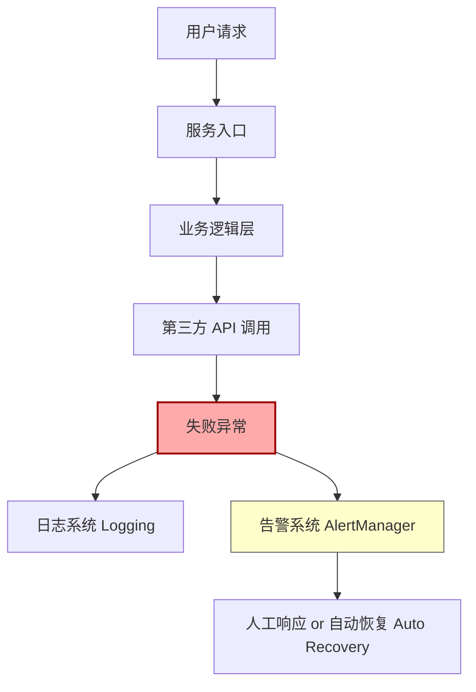

## 第十二篇：火攻篇

**Chapter 12: Attack by Fire**
**Bug 火攻：异常处理与系统恢复机制**

---

### 🏮 原文 + 英译 Original & Translation

> **凡火攻有五：一曰火人，二曰火积，三曰火辎，四曰火库，五曰火队。**
> There are five ways to attack with fire: burn people, burn supplies, burn transport, burn stores, and burn formations.

> **以火佐攻，因火而应变者胜。**
> Use fire as a tool of attack, and respond quickly to it to win.

> **火发于内，因敌火而应变，不可迟也。**
> When fire breaks out inside, respond to it promptly — never delay.

---

### 💡 程序员解读 Programmer's Interpretation

> 在软件系统中，“火攻”就是 **Bug/崩溃/异常**，尤其发生在生产环境时。
> In software, "fire attacks" refer to bugs, crashes, and incidents — especially in production.

> 若无监控、无报警、无响应流程，Bug 一烧，系统全毁。
> Without monitoring, alerts, or response protocols, one bug can burn everything down.

> 孙子提出的“五种火攻”，可类比为系统的五种脆弱点：
> Sun Tzu's five fire attacks can be mapped to software system weak points:

| 火攻类型 | 软件类比   | 示例            |
| ---- | ------ | ------------- |
| 火人   | 人员操作失误 | 手动误删生产数据      |
| 火积   | 数据积压   | 队列堵塞、死锁       |
| 火辎   | 网络阻塞   | 第三方 API 超时    |
| 火库   | 资源枯竭   | 磁盘满、内存泄漏      |
| 火队   | 服务宕机   | 服务连锁崩溃、容器重启风暴 |

---

### 🧪 应用场景 Application Scenarios

> * 设置生产环境告警（如 CPU、内存、错误率）
> * Production-level alerts (CPU, memory, error rate)

> * 引入监控系统（如 Prometheus + Grafana / ELK）
> * Integrated monitoring systems (e.g., Prometheus, Grafana, ELK)

> * 设置自动重启与熔断机制（如 Polly、K8s livenessProbe）
> * Auto-restart and circuit breaker strategies (e.g., Polly, K8s probes)

> * 构建“事后分析 + 火灾演练”机制
> * Postmortems and fire drills as process norms

---

### ⚔️ 技术格言 Technical Aphorism

> 系统不是怕 Bug，而是怕无响应。
> Systems don’t fear bugs — they fear silence.

> 真正的 DevOps，从发现 Bug 到恢复服务，不超 10 分钟。
> True DevOps resolves fire from alert to recovery within 10 minutes.

> 防火墙是硬件，防“火攻”靠流程。
> Firewalls are hardware. Fighting fire means having process.

---

### 💻 C# 代码类比 Code Analogy

```csharp
public class ResilientService
{
    private readonly ILogger _logger;

    public ResilientService(ILogger logger)
    {
        _logger = logger;
    }

    public async Task<string> CallExternalApiAsync()
    {
        try
        {
            // 模拟调用第三方 API
            var result = await HttpGetAsync("https://api.example.com/data");
            return result;
        }
        catch (Exception ex)
        {
            _logger.LogError(ex, "🔥 外部服务调用失败！");
            TriggerAlert("API Failure");
            return "fallback-response";
        }
    }

    private void TriggerAlert(string message) =>
        Console.WriteLine($"🚨 ALERT: {message}");
}
```

> “日志记录 + 自动告警 + 降级处理”三位一体，是防火攻的核心流程。
> Logging + alerting + fallback = the holy trinity of fire defense.

---

### 🗺️ 架构图示 Architectural Diagram (Mermaid)



> 架构图展示了一次异常从发生到报警再到恢复的火攻应对流程。
> This diagram shows the fire-response pipeline: failure → alert → action.

---

### 📌 总结 Summary

> * 系统必须具备“自燃监测 + 火线反应 + 自动修复”机制
> * Systems must be self-aware, quick-reactive, and self-healing

> * 日志、告警、熔断、限流、重启是“火攻防御五宝”
> * Logs, alerts, circuit breakers, throttling, and restarts form your fire defense arsenal

> * 火攻不可防，但可控；怕火不可怕，怕没准备才可怕
> * Fire is inevitable — but survivable. Be prepared, not afraid.
