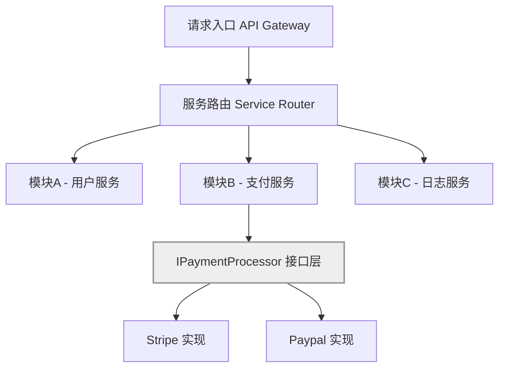

## 第四篇：军形篇

**Chapter 4: Tactical Dispositions**
**组织架构：团队阵型与模块边界**

---

### 🏮 原文 + 英译 Original & Translation

> **昔之善战者，先为不可胜，以待敌之可胜。**
> Those skilled in warfare first make themselves invincible, and then wait for the enemy to become vulnerable.

> **故善战者，立于不败之地，而不失敌之败也。**
> Therefore, the skilled commander positions himself beyond the possibility of defeat and then waits for an opportunity to defeat the enemy.

> **胜可知，而不可为。**
> Victory can be anticipated, but not compelled.

---

### 💡 程序员解读 Programmer's Interpretation

> 真正强大的系统，不是“能打”，而是“不容易挂”。
> A truly strong system is not one that fights well, but one that doesn’t break easily.

> **“立于不败之地”**，就是构建一个“不可被打穿”的架构和团队结构。
> “Positioning for invincibility” means building architectures and teams that resist failure.

> 在软件世界中，这意味着：
> In the software world, this means:

* 职责明确的模块边界
* Clearly defined module boundaries
* 不依赖英雄主义的团队分工
* Team roles that don’t rely on superheroes
* 自动化守护系统的稳定
* Automation to maintain stability

---

### 🧪 应用场景 Application Scenarios

> * 微服务与模块划分策略（如按领域 vs 按团队）
> * Microservice/module boundaries: by domain or by team

> * DevOps 团队职责边界
> * Boundaries of Dev, QA, and DevOps responsibilities

> * 可插拔架构设计（插件系统、接口隔离）
> * Pluggable architecture design (plugin systems, interface segregation)

> * 灰度发布与降级机制
> * Canary releases and graceful degradation

---

### ⚔️ 技术格言 Technical Aphorism

> 系统之强，不在于应对复杂，而在于不怕崩溃。
> A robust system is not one that handles everything — it’s one that survives failure.

> 架构的胜利，是让团队不再靠“天才开发者”生存。
> True architectural victory means the team no longer depends on heroes.

---

### 💻 C# 代码类比 Code Analogy

```csharp
public interface IPaymentProcessor
{
    bool Charge(decimal amount);
}

public class StripeProcessor : IPaymentProcessor
{
    public bool Charge(decimal amount)
    {
        // Stripe 具体实现
        return true;
    }
}

public class PaymentService
{
    private readonly IPaymentProcessor _processor;

    public PaymentService(IPaymentProcessor processor)
    {
        _processor = processor;
    }

    public bool TryCharge(decimal amount)
    {
        try
        {
            return _processor.Charge(amount);
        }
        catch (Exception)
        {
            return false; // 不崩溃，系统自愈
        }
    }
}
```

> 接口隔离 + 错误包裹 + 可插拔处理，即是“不败之地”的基本模型。
> Interface segregation + error handling + pluggability = a foundation for invincibility.

---

### 🗺️ 架构图示 Architectural Diagram (Mermaid)



> 模块边界明确、实现可替换、接口解耦，架构即“布阵”。
> Clear module boundaries and interface decoupling — architecture is your tactical formation.

---

### 📌 总结 Summary

> * 模块的强大在于独立，团队的强大在于互不依赖
> * Modules are powerful when independent; teams are powerful when self-reliant

> * 架构应为失败而设计，不应假设一切总能成功
> * Architect for failure, not for perfection

> * 稳定不是被动等待，而是“先为不可胜”的设计哲学
> * Stability is not passive — it's a design mindset of preemptive invincibility
